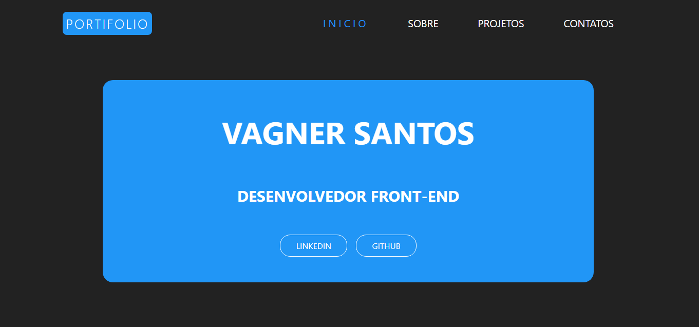
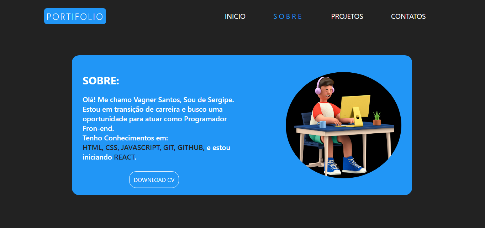
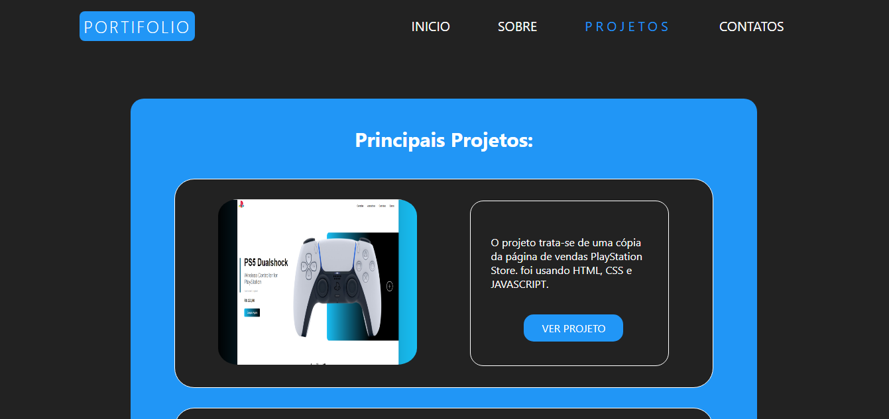
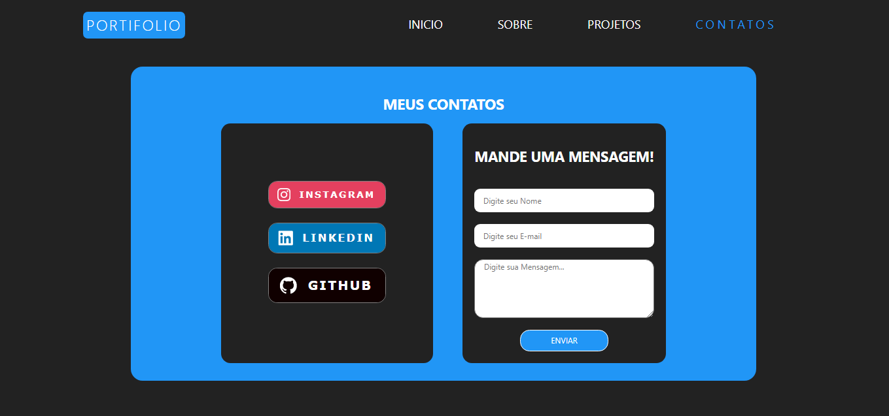

# Portifolio

> Resultado do portifolio.

### Ajustes e melhorias

O projeto trata-se de um mini site com pagina inicial, sobre, projetos e contatos. o projeto ja está no ar e foram usados:

- [x] Criação do HTML
- [x] Criação do CSS
- [x] Criação do JAVASCRIPT
- [x] Responsividade

## 🤝 Colaboradores

Agradecemos às seguintes pessoas que contribuíram para este projeto:

<table>
  <tr>
    <td align="center">
      <a href="#">
         
        
          <b>Vagner Santos</b>
        
      </a>
    </td>
  </tr>
</table>

